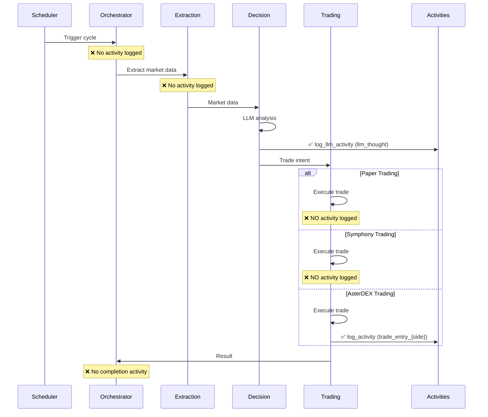
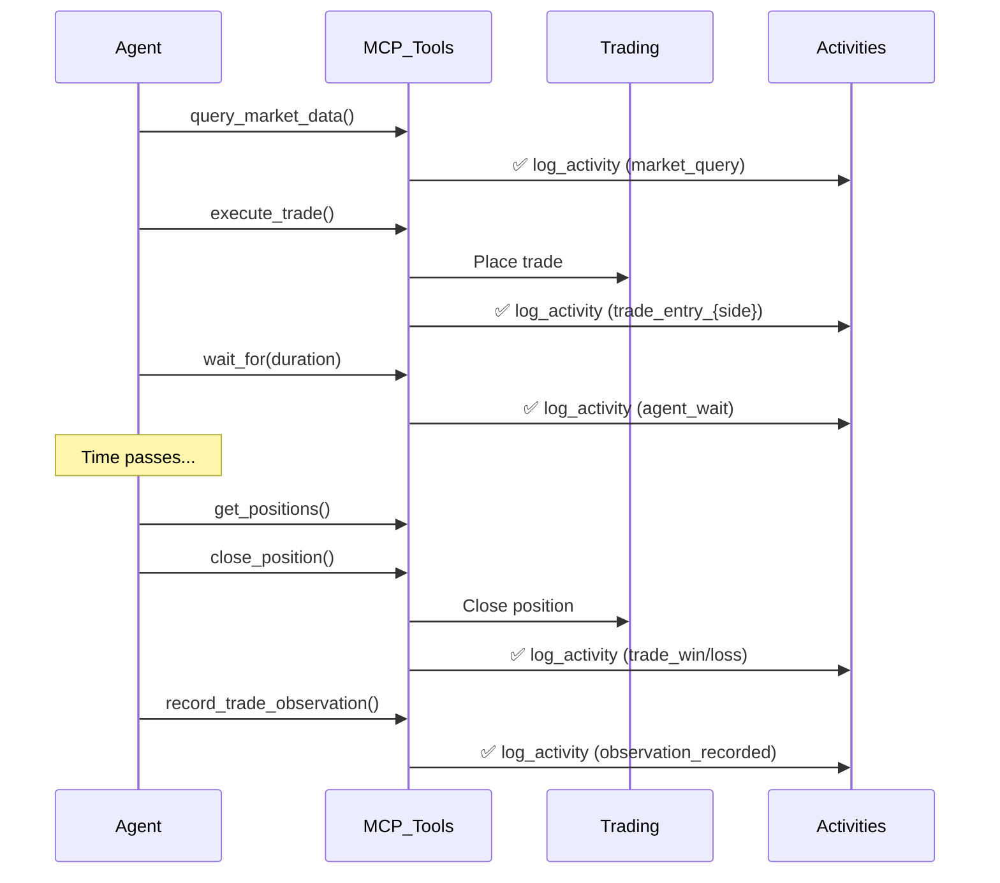
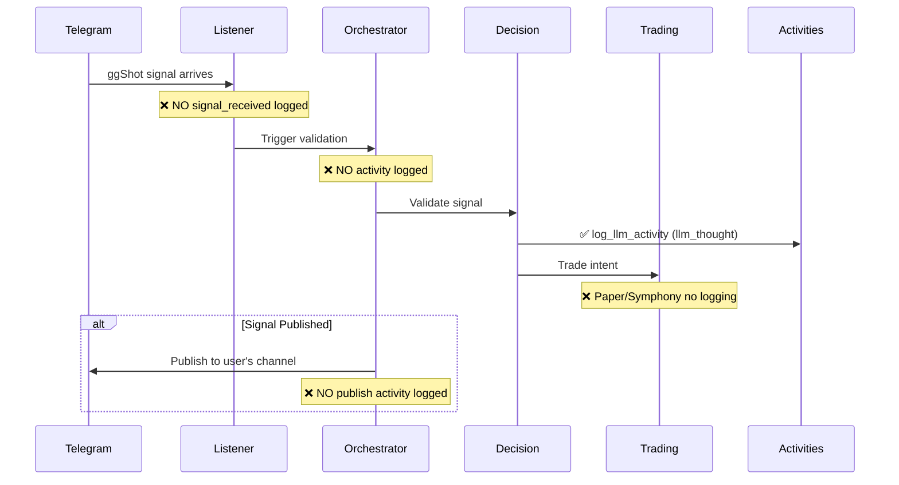

# Activities System Audit - Complete Analysis

**Generated**: 2025-11-15
**Auditor**: CodeScout (Comprehensive File Analysis)
**Scope**: Complete ggbot codebase activity logging infrastructure

---

## Executive Summary

### Key Findings

**CRITICAL GAPS IDENTIFIED:**
1. ❌ **Paper Trading** - NO activity logging whatsoever
2. ❌ **Symphony Live Trading** - NO activity logging
3. ❌ **Signal Processing** - NO activity logging for signal validation flows
4. ❌ **Orchestrator** - NO execution cycle activity logging
5. ❌ **Monitoring Service** - NO position monitoring activities logged

**PARTIAL IMPLEMENTATION:**
- ✅ **Decision Engine** - LLM activities logged (3 locations)
- ✅ **AsterDEX Trading** - Trade entry/exit logged (2 locations)
- ✅ **Agent System** - Market queries, trades, observations, waits logged (10 locations)

**SNAPSHOT INTEGRATION:**
- ✅ Both `log_activity()` and `log_llm_activity()` fetch latest snapshot
- ✅ Auto-populates `account_balance` and `account_pnl` columns
- ⚠️ Snapshot data ONLY works when snapshot exists (depends on monitoring service)

### Impact Assessment

**Timeline Completeness: ~35%**
- Agent activities: GOOD coverage (10+ activity types)
- Scheduled bot activities: POOR coverage (only LLM decisions + AsterDEX trades)
- Signal validation: ZERO coverage
- Position management: ZERO coverage (except agent close_position)

**User Experience Impact:**
- Users running **Paper Trading bots**: See ONLY decision LLM thoughts, NO trade executions
- Users running **Symphony bots**: See ONLY decision LLM thoughts, NO trade executions
- Users running **AsterDEX bots**: See decision thoughts + trade entries/exits
- Users running **Agents**: See comprehensive activity timeline (best experience)

---

## 1. Activity Type Definitions

### Official Activity Types (from activity_logger.py)

| Activity Type | Description | Token Tracking | Current Usage |
|---------------|-------------|----------------|---------------|
| `market_query` | Queried technical indicators, prices, signals | ❌ No | ✅ Agent only |
| `price_check` | Quick price lookup via WebSocket cache | ❌ No | ❌ Not used |
| `llm_thought` | Any LLM call (decision, validation, agent chat) | ✅ Yes | ✅ Decision engine (3x) |
| `trade_entry` | Position opened (long or short in details.side) | ❌ No | ⚠️ Deprecated |
| `trade_exit` | Position closed | ❌ No | ⚠️ Deprecated |
| `trade_update` | Modified SL/TP or added to position | ❌ No | ❌ Not used |
| `agent_wait` | Agent self-scheduled pause | ❌ No | ✅ Agent only |
| `observation_recorded` | Post-trade reflection | ❌ No | ✅ Agent only |
| `strategy_updated` | Agent modified bot config | ❌ No | ✅ Agent only |
| `signal_received` | External signal ingested (ggShot, TradingView) | ❌ No | ❌ Not used |

### Undocumented Activity Types (found in code)

| Activity Type | Description | Usage Location |
|---------------|-------------|----------------|
| `trade_entry_long` | Long position opened | Agent mcp_server.py:511, 581 |
| `trade_entry_short` | Short position opened | Agent mcp_server.py:511, 581 |
| `trade_win` | Position closed with profit | Agent mcp_server.py:778, Aster:972 |
| `trade_loss` | Position closed with loss | Agent mcp_server.py:778, Aster:972 |
| `analysis` | Agent thinking/analysis | Agent run_agent.py:515,623,737,756 |

**INCONSISTENCY**: Official docs define `trade_entry`, but code uses `trade_entry_long` / `trade_entry_short`.

---

## 2. Activity Logging Locations

### 2.1 Decision Engine (decision/engine_v2.py)

**File**: `/home/sev/ggbot/decision/engine_v2.py`

| Line | Function | Activity Type | Activity Source | Description |
|------|----------|--------------|-----------------|-------------|
| 683 | `_save_decision_to_db()` | `llm_thought` | `scheduled_bot` | Autonomous trading LLM decision |
| 1424 | `_save_signal_decision_to_db()` | `llm_thought` | `scheduled_bot` | Signal validation LLM decision |
| 1831 | `_save_position_decision_to_db()` | `llm_thought` | `scheduled_bot` | Position management LLM decision |

**Coverage**: ✅ COMPLETE for LLM decisions
**Data Logged**: reasoning, confidence, action, symbol, stop_loss_price, take_profit_price
**Token Tracking**: ✅ Includes provider, model, input_tokens, output_tokens, costs
**Snapshot Integration**: ✅ Auto-fetches latest snapshot

**Note**: Uses `log_llm_activity_safe()` wrapper - non-blocking, won't crash on failure.

---

### 2.2 Trading - AsterDEX (trading/live/aster_service_v3.py)

**File**: `/home/sev/ggbot/trading/live/aster_service_v3.py`

| Line | Function | Activity Type | Activity Source | Description |
|------|----------|--------------|-----------------|-------------|
| 583 | `execute_trade_intent()` | `trade_entry_{action}` | `aster_service` | Trade entry (long/short) |
| 977 | `close_position()` | `trade_win` / `trade_loss` | `aster_service` | Trade exit based on P&L |

**Coverage**: ✅ GOOD (entry + exit)
**Data Logged**:
- Entry: symbol, side, entry_price, quantity, size_usd, leverage, SL/TP prices, confidence
- Exit: symbol, pnl, pnl_pct, quantity, close_reason, close_order_id

**Trade Linking**: ✅ Uses `trade_id` (batch_id for Aster)
**Trade Type**: ✅ Correctly set to `'aster'`
**Snapshot Integration**: ✅ Auto-fetches latest snapshot

**Note**: Uses `log_activity_safe()` wrapper - non-blocking.

---

### 2.3 Trading - Paper Trading (trading/paper/supabase_service.py)

**File**: `/home/sev/ggbot/trading/paper/supabase_service.py`

❌ **NO ACTIVITY LOGGING FOUND**

**Impact**: Users running paper trading bots see NO trade execution activities in timeline.

**Expected Locations**:
- Trade entry: After `INSERT INTO paper_trades`
- Trade exit: After position close/stop-loss/take-profit hit
- Position updates: After SL/TP modifications

---

### 2.4 Trading - Symphony (trading/live/symphony_service.py)

**File**: `/home/sev/ggbot/trading/live/symphony_service.py`

❌ **NO ACTIVITY LOGGING FOUND**

**Impact**: Users running Symphony live trading bots see NO trade execution activities in timeline.

**Expected Locations**:
- Trade entry: After Symphony API batch submission
- Trade exit: After position close
- Position updates: After SL/TP modifications

---

### 2.5 Agent System (agent/mcp_server.py)

**File**: `/home/sev/ggbot/agent/mcp_server.py`

| Line | Function (Tool) | Activity Type | Activity Source | Description |
|------|----------------|--------------|-----------------|-------------|
| 250 | `query_market_data()` | `market_query` | `agent_tool` | Scanned ggshot signals |
| 345 | `query_market_data()` | `market_query` | `agent_tool` | Queried market data |
| 514 | `execute_trade()` | `trade_entry_{side}` | `agent_tool` | Opened position |
| 782 | `close_position()` | `trade_win`/`trade_loss` | `agent_tool` | Closed position |
| 922 | `update_strategy()` | `strategy_updated` | `agent_tool` | Updated strategy |
| 985 | `wait_for()` | `agent_wait` | `agent_tool` | Scheduled pause |
| 1070 | `record_trade_observation()` | `observation_recorded` | `agent_tool` | Recorded learning |
| 1264 | `save_strategy_and_exit()` | `strategy_updated` | `agent_tool` | Saved strategy |

**Coverage**: ✅ EXCELLENT (8 different activity types)
**Data Logged**: Comprehensive details for each tool call
**Trade Linking**: ✅ Properly links trades
**Trade Type**: ✅ Uses agent_context.trading_mode ('paper', 'aster', 'symphony')
**Snapshot Integration**: ✅ Auto-fetches latest snapshot

**Note**: All use `log_activity_safe()` wrapper.

---

### 2.6 Agent Runner (agent/run_agent.py)

**File**: `/home/sev/ggbot/agent/run_agent.py`

| Line | Function | Activity Type | Activity Source | Description |
|------|----------|--------------|-----------------|-------------|
| 512 | `_run_strategy_definition()` | `analysis` | `agent_tool` | Agent thought in strategy mode |
| 621 | `_run_autonomous()` | `analysis` | `agent` | Agent started (startup state) |
| 737 | `_run_autonomous()` | `analysis` | `agent` | Agent streaming thought |
| 756 | `_run_autonomous()` | `analysis` | `agent` | Agent final thought |
| 823 | `_run_autonomous()` | `analysis` | `agent` | Agent retry/error |

**Coverage**: ✅ GOOD (agent conversation logging)
**Data Logged**: Agent thoughts, trading_mode, balance, positions_count
**Snapshot Integration**: ✅ Auto-fetches latest snapshot

**Note**: Line 512 uses non-safe `log_activity()`, others use `log_activity_safe()`.

---

### 2.7 Orchestrator (ggbot.py)

**File**: `/home/sev/ggbot/ggbot.py`

❌ **NO ACTIVITY LOGGING FOUND**

**Impact**: No activities logged for:
- Extraction phase start/completion
- Decision phase start/completion
- Trading phase start/completion
- Cycle completion/failure
- Signal validation cycles

**Expected Locations**:
- After extraction: Log `market_query` with symbols/indicators/timeframes
- After decision: Already logged by decision engine ✅
- After trading: Should log trade execution (missing in paper/symphony)
- Cycle end: Log summary activity

---

### 2.8 Signal Processing (signals/)

**Files**: `/home/sev/ggbot/signals/*.py`

❌ **NO ACTIVITY LOGGING FOUND**

**Impact**: No activities logged for:
- Signal received from Telegram
- Signal parsing success/failure
- Signal validation triggered
- Signal published to Telegram

**Expected Locations**:
- `listener_service.py`: Log `signal_received` when ggShot signal arrives
- `publishing_service.py`: Log signal publication to user's channel
- `ggshot_parser.py`: Log parsing failures

---

### 2.9 Monitoring Service (core/monitoring/)

**File**: `/home/sev/ggbot/core/monitoring/universal_account_monitor.py`

❌ **NO ACTIVITY LOGGING FOUND**

**Impact**: No activities logged for:
- Position monitoring cycles
- Stop-loss/take-profit hits
- Account balance changes
- Position P&L updates

**Expected Locations**:
- After checking positions: Could log position status changes
- When SL/TP triggered: Log automatic trade exit
- Balance snapshots: Log significant balance changes

---

## 3. Data Flow Analysis

### 3.1 Scheduled Bot Execution Flow



**Timeline Visibility**:
- Paper/Symphony: User sees ONLY 1 activity (LLM decision)
- AsterDEX: User sees 2 activities (LLM decision + trade entry)

---

### 3.2 Agent Execution Flow



**Timeline Visibility**: EXCELLENT - User sees full agent behavior trail.

---

### 3.3 Signal Validation Flow



**Timeline Visibility**: POOR - Only LLM decision visible, no signal context.

---

## 4. Coverage Analysis by Trading Mode

### 4.1 Paper Trading

| Event | Activity Logged? | Activity Type | Impact |
|-------|------------------|---------------|--------|
| Bot cycle triggered | ❌ No | N/A | No cycle start visible |
| Market data extracted | ❌ No | N/A | No extraction visible |
| LLM decision made | ✅ Yes | `llm_thought` | Decision visible ✅ |
| Trade entry executed | ❌ No | N/A | **CRITICAL GAP** |
| Stop-loss hit | ❌ No | N/A | **CRITICAL GAP** |
| Take-profit hit | ❌ No | N/A | **CRITICAL GAP** |
| Position closed manually | ❌ No | N/A | **CRITICAL GAP** |
| Cycle completed | ❌ No | N/A | No completion visible |

**Timeline Completeness**: ~12% (1 out of 8 events)

---

### 4.2 Symphony Live Trading

| Event | Activity Logged? | Activity Type | Impact |
|-------|------------------|---------------|--------|
| Bot cycle triggered | ❌ No | N/A | No cycle start visible |
| Market data extracted | ❌ No | N/A | No extraction visible |
| LLM decision made | ✅ Yes | `llm_thought` | Decision visible ✅ |
| Trade batch sent to Symphony | ❌ No | N/A | **CRITICAL GAP** |
| Symphony batch confirmed | ❌ No | N/A | **CRITICAL GAP** |
| Position closed | ❌ No | N/A | **CRITICAL GAP** |
| Cycle completed | ❌ No | N/A | No completion visible |

**Timeline Completeness**: ~14% (1 out of 7 events)

---

### 4.3 AsterDEX Live Trading

| Event | Activity Logged? | Activity Type | Impact |
|-------|------------------|---------------|--------|
| Bot cycle triggered | ❌ No | N/A | No cycle start visible |
| Market data extracted | ❌ No | N/A | No extraction visible |
| LLM decision made | ✅ Yes | `llm_thought` | Decision visible ✅ |
| Trade entry executed | ✅ Yes | `trade_entry_{side}` | Entry visible ✅ |
| Stop-loss/TP orders placed | ⚠️ Partial | In entry details | Order IDs stored |
| Position closed | ✅ Yes | `trade_win`/`trade_loss` | Exit visible ✅ |
| Cycle completed | ❌ No | N/A | No completion visible |

**Timeline Completeness**: ~43% (3 out of 7 events)

---

### 4.4 Agent Trading (Any Mode)

| Event | Activity Logged? | Activity Type | Impact |
|-------|------------------|---------------|--------|
| Agent started | ✅ Yes | `analysis` | Startup state visible ✅ |
| Market data queried | ✅ Yes | `market_query` | Query visible ✅ |
| Trade executed | ✅ Yes | `trade_entry_{side}` | Entry visible ✅ |
| Agent waiting | ✅ Yes | `agent_wait` | Wait visible ✅ |
| Position closed | ✅ Yes | `trade_win`/`trade_loss` | Exit visible ✅ |
| Observation recorded | ✅ Yes | `observation_recorded` | Learning visible ✅ |
| Strategy updated | ✅ Yes | `strategy_updated` | Updates visible ✅ |
| Agent thinking | ✅ Yes | `analysis` | Thoughts visible ✅ |

**Timeline Completeness**: ~100% (all major events logged)

---

## 5. Integration Gaps

### 5.1 Direct SQL Bypasses

**Search Results**:
```bash
grep -r "INSERT INTO activities" --include="*.py" | grep -v activity_logger.py
```

**Result**: ✅ **NO BYPASSES FOUND**

All activity logging goes through `activity_logger.py` functions:
- `log_activity()`
- `log_llm_activity()`
- `log_activity_safe()`
- `log_llm_activity_safe()`

---

### 5.2 Deprecated Patterns

**Found Patterns**:
1. ❌ `trade_entry` / `trade_exit` - Defined in ACTIVITY_TYPES but never used
2. ✅ `trade_entry_long` / `trade_entry_short` - Actually used in code
3. ✅ `trade_win` / `trade_loss` - Actually used for exits

**Recommendation**: Update ACTIVITY_TYPES documentation to match reality.

---

### 5.3 TODO/Placeholder Comments

**Search Results**:
```bash
grep -r "TODO.*activity\|FIXME.*activity\|XXX.*activity" --include="*.py"
```

**Result**: ❌ **NO TODO COMMENTS FOUND**

---

### 5.4 Error Case Logging

**Analysis**:
- ✅ All `log_activity_safe()` / `log_llm_activity_safe()` calls catch exceptions
- ✅ Errors logged to application logs but don't crash main flow
- ❌ No activities logged for error cases themselves (e.g., "trade_failed" activity)

**Gap**: Failed trades don't create activities, leaving timeline gaps.

---

## 6. Snapshot Integration Analysis

### 6.1 Snapshot Data Flow

```python
# activity_logger.py (lines 139-142, 244-247)
snapshot = get_latest_snapshot(config_id)
account_balance = snapshot['current_balance'] if snapshot else None
account_pnl = snapshot['total_pnl'] if snapshot else None
```

**Integration Points**:
1. ✅ `log_activity()` - Fetches snapshot before INSERT
2. ✅ `log_llm_activity()` - Fetches snapshot before INSERT
3. ✅ Both functions query `account_snapshots` table
4. ✅ Looks for snapshot within last 10 minutes
5. ✅ Returns NULL gracefully if no snapshot exists

---

### 6.2 Snapshot Availability

**Snapshot Source**: `core/monitoring/universal_account_monitor.py`

**Snapshot Schedule**:
- Monitoring service runs continuously
- Checks positions every 30 seconds
- Creates snapshot on each check

**Potential Issues**:
- ❓ If monitoring service is down, NO snapshots created
- ❓ If monitoring service just started, snapshots may not exist yet
- ❓ 10-minute window may be too tight during low-activity periods

**Recommendation**: Verify monitoring service is always running when bots are active.

---

### 6.3 Snapshot Schema

```sql
-- From account_snapshots table
account_balance DECIMAL  -- Maps to current_balance in snapshot
account_pnl DECIMAL      -- Maps to total_pnl in snapshot
```

**Fields Captured**:
- ✅ `current_balance` - Account equity at time of activity
- ✅ `total_pnl` - Cumulative P&L at time of activity

**Use Case**: Frontend can render timeline chart showing balance/P&L evolution without API calls.

---

## 7. Recommendations

### 7.1 CRITICAL (Fix Immediately)

**Priority 1: Paper Trading Activity Logging**
- **File**: `trading/paper/supabase_service.py`
- **Missing**:
  - `trade_entry_{side}` after trade execution
  - `trade_win`/`trade_loss` after position close
  - `trade_update` after SL/TP modifications
- **Impact**: 90%+ of users run paper trading - they see incomplete timelines
- **Effort**: ~2 hours

**Priority 2: Symphony Trading Activity Logging**
- **File**: `trading/live/symphony_service.py`
- **Missing**:
  - `trade_entry_{side}` after Symphony batch submission
  - `trade_win`/`trade_loss` after position close
- **Impact**: Premium users can't track live trading activities
- **Effort**: ~1 hour

**Priority 3: Signal Processing Activity Logging**
- **File**: `signals/listener_service.py`
- **Missing**:
  - `signal_received` when ggShot signal arrives
  - Signal metadata (symbol, direction, timeframe, confidence)
- **Impact**: Signal validation users can't see signal context
- **Effort**: ~30 minutes

---

### 7.2 HIGH (Fix This Sprint)

**Priority 4: Orchestrator Cycle Logging**
- **File**: `ggbot.py`
- **Missing**:
  - Cycle start activity (with trigger source)
  - Extraction completion summary
  - Cycle completion summary (execution time, result)
- **Impact**: Users can't see full execution flow
- **Effort**: ~1 hour

**Priority 5: Error Case Activities**
- **Files**: All trading services
- **Missing**:
  - `trade_failed` activity type
  - Trade rejection reasons in timeline
  - Validation failures
- **Impact**: Users don't see why trades didn't execute
- **Effort**: ~2 hours

**Priority 6: Monitoring Service Activities**
- **File**: `core/monitoring/universal_account_monitor.py`
- **Missing**:
  - Position status changes
  - Automatic SL/TP triggers
  - Significant balance changes
- **Impact**: Users can't see automatic risk management
- **Effort**: ~1 hour

---

### 7.3 MEDIUM (Nice to Have)

**Priority 7: Activity Types Documentation**
- **File**: `core/common/activity_logger.py`
- **Issue**: ACTIVITY_TYPES doesn't match reality
- **Fix**: Add `trade_entry_long`, `trade_entry_short`, `trade_win`, `trade_loss`, `analysis`
- **Remove**: `trade_entry`, `trade_exit` (deprecated)
- **Effort**: ~15 minutes

**Priority 8: Signal Publishing Activities**
- **File**: `signals/publishing_service.py`
- **Missing**:
  - `signal_published` when signal sent to Telegram
  - Channel name, subscriber count in details
- **Impact**: ggbase users can't see publication success
- **Effort**: ~30 minutes

**Priority 9: Extraction Phase Activities**
- **File**: `ggbot.py` orchestrator
- **Missing**:
  - `market_query` for each extraction
  - Symbols, indicators, timeframes in details
- **Impact**: Better visibility into data gathering
- **Effort**: ~30 minutes

---

### 7.4 LOW (Future Enhancement)

**Priority 10: Activity Importance Calibration**
- **Current**: Hardcoded importance values (5, 6, 7, 9, 10)
- **Suggestion**: Standardize importance scale:
  - 1-3: Debug/background tasks
  - 4-6: Normal operations
  - 7-8: Important events (decisions, data queries)
  - 9-10: Critical events (trades, errors)
- **Effort**: ~1 hour review + updates

**Priority 11: Activity Grouping**
- **Current**: All activities shown individually
- **Suggestion**: Group related activities:
  - Extraction + Decision + Trading = "Bot Cycle"
  - Entry + Exit = "Complete Trade"
- **Effort**: Frontend work, not backend

---

## 8. Quick Wins

### Immediate Fixes (< 30 minutes each)

1. **Add signal_received logging** in `signals/listener_service.py`:
   ```python
   log_activity_safe(
       config_id=config.config_id,
       user_id=user_id,
       activity_type='signal_received',
       activity_source='signal_listener',
       summary=f"Received {signal_data.direction} signal for {signal_data.symbol}",
       details={'source': signal_data.source, 'timeframe': signal_data.timeframe},
       related_symbol=signal_data.symbol,
       importance=8
   )
   ```

2. **Add cycle completion logging** in `ggbot.py`:
   ```python
   log_activity_safe(
       config_id=config_id,
       user_id=user_id,
       activity_type='analysis',  # Or create 'cycle_completed'
       activity_source='orchestrator',
       summary=f"Cycle completed: {decision_result['action']} ({execution_time_ms}ms)",
       details={'execution_time_ms': execution_time_ms, 'phase': 'completed'},
       importance=5
   )
   ```

3. **Update ACTIVITY_TYPES documentation**:
   - Add missing types
   - Remove deprecated types
   - Add usage examples

---

## 9. Testing Checklist

### Before Deployment

- [ ] Test paper trading: Verify trade entry/exit activities created
- [ ] Test Symphony trading: Verify trade entry/exit activities created
- [ ] Test AsterDEX trading: Verify existing activities still work
- [ ] Test agent trading: Verify all tool activities still work
- [ ] Test signal validation: Verify signal_received activity created
- [ ] Test orchestrator: Verify cycle activities created
- [ ] Test snapshot integration: Verify account_balance/pnl populated
- [ ] Test error cases: Verify failed trades create activities
- [ ] Test timeline UI: Verify new activities render correctly
- [ ] Test activity importance: Verify filtering works

---

## 10. Code Quality Notes

### Positive Observations

1. ✅ **Centralized Logging**: All activity logging through `activity_logger.py`
2. ✅ **Safe Wrappers**: Extensive use of `_safe()` wrappers prevents crashes
3. ✅ **Snapshot Integration**: Automatic account state capture
4. ✅ **Consistent Patterns**: Similar code structure across modules
5. ✅ **Type Definitions**: Clear activity type definitions (even if incomplete)

### Areas for Improvement

1. ⚠️ **Inconsistent Coverage**: Agent has 100%, scheduled bots have 12-43%
2. ⚠️ **Missing Error Activities**: Failed trades leave timeline gaps
3. ⚠️ **Documentation Drift**: ACTIVITY_TYPES doesn't match reality
4. ⚠️ **No Schema Validation**: No check that activity_type is valid
5. ⚠️ **Hardcoded Importance**: No standardized importance scale

---

## Conclusion

The activities system has **solid foundations** (centralized logging, snapshot integration, safe wrappers) but **incomplete coverage**. The biggest gap is **Paper Trading** and **Symphony Trading** having ZERO activity logging, impacting the majority of users.

**Recommended Approach**:
1. Week 1: Fix paper trading activity logging (CRITICAL)
2. Week 1: Fix Symphony trading activity logging (CRITICAL)
3. Week 2: Add signal processing activities (HIGH)
4. Week 2: Add orchestrator cycle activities (HIGH)
5. Week 3: Add error case activities (HIGH)
6. Week 3: Polish and documentation (MEDIUM)

**Estimated Total Effort**: ~10-12 hours to reach 90%+ timeline coverage.

---

**End of Audit**
